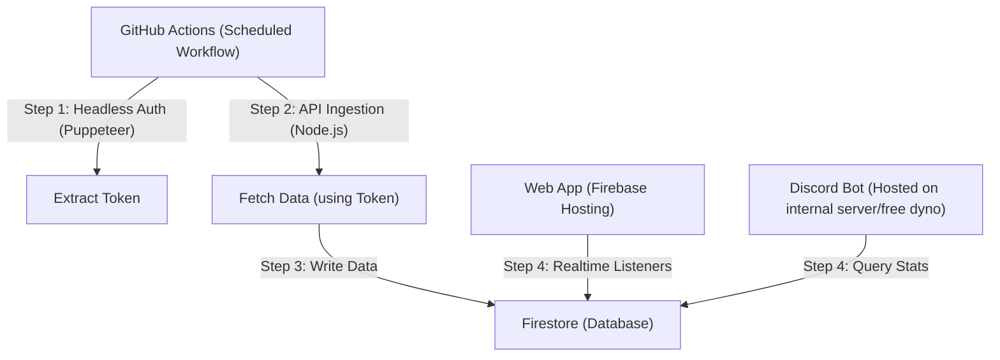

# SportNinja Data System Design (Free Tier Edition)

## Overview
A **strictly free-tier** compliant architecture using **Firebase (Spark Plan)** for storage/hosting and **GitHub Actions** for compute/scheduling.

> [!IMPORTANT]
> **Constraint Checklist**
> *   **Firebase Spark Plan**: No Cloud Functions allowed (requires Blaze).
> *   **Compute**: GitHub Actions (Free for 2000 mins/month) replaces Cloud Functions.
> *   **Storage**: Firestore (Free 1GB, 50k reads/day).

## Architecture



### 1. Ingestion Worker (GitHub Actions)
**Why?** Firebase Cloud Functions require a credit card (Blaze plan). GitHub Actions is completely free for scheduled cron jobs.
*   **Trigger**: `schedule: - cron: '0 */6 * * *'` (Runs every 6 hours).
*   **Workflow**:
    1.  **Checkout Code**.
    2.  **Setup Node**.
    3.  **Run Scraper Script**:
        *   Launch Puppeteer (Headless).
        *   Navigate to Sno King.
        *   Extract `session_token_iframe`.
        *   Fetch API data using the token.
        *   Write result to Firestore using `firebase-admin` SDK with a Service Account Key (stored in GitHub Secrets).

### 2. Data Model (Firestore)
Remains the same. Firestore's free tier (50k reads/20k writes per day) is sufficient.

**Collection: `teams`**
Document ID: `teamId`
```json
{
  "name": "Tuesday Knights",
  "division": "Gold",
  "lastUpdated": "2025-01-01T12:00:00Z"
}
```

**Collection: `games`**
Document ID: `gameId`
```json
{
  "startAt": "2025-09-10T04:00:00Z",
  "scores": { "home": 3, "visitor": 2 },
  "status": "FINAL"
}
```

### 3. Presentation Layer
*   **Frontend**: React app hosted on **Firebase Hosting** (Free).
    *   **Direct Access**: The browser app reads data directly from Firestore (`teams` and `games` collections) using the Firebase Client SDK.
    *   **Security**: `firestore.rules` are configured to allow public READ access to these collections but block WRITE access (reserved for ingestion backend).
*   **Discord Bot**: Can arguably run inside the GitHub Action *if* it's just posting updates (webhooks). For a conversational bot, you'd need a separate free host (like Fly.io or a Raspberry Pi), but that's out of scope for the core data pipeline.

## Implementation Roadmap
1.  **Firebase Setup**: Create Project -> Enable Firestore -> Generate Service Account Key.
2.  **Repo Setup**: Add Service Account Key to GitHub Secrets (`FIREBASE_SERVICE_ACCOUNT`).
3.  **Scraper Script**: A TypeScript script `src/ingest.ts` that handles Auth + Fetch + Write in one go.
4.  **Workflow**: `.github/workflows/ingest.yml` to run the script.
